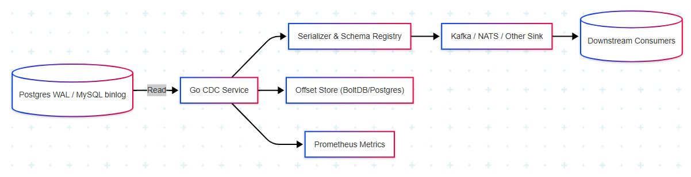

# Go CDC Service

## Overview

This project implements a **Change Data Capture (CDC) pipeline** in Go that:
1. Reads real-time changes (INSERT, UPDATE, DELETE) from PostgreSQL via logical replication.
2. Streams these changes into Kafka.
3. Consumes Kafka topics and upserts events into Elasticsearch.
4. Provides snapshot/backfill functionality to seed initial data.
5. Persists replication state for crash-resilience.
6. Offers logging via SQLite.
7. Visualizes changes in Kibana.

---

## Architecture



---

## Table of Contents

- [Prerequisites](#prerequisites)
- [Setup](#setup)
  - [Clone Repository](#clone-repository)
  - [Configuration](#configuration)
  - [Docker Services](#docker-services)
- [Project Structure](#project-structure)
- [Components](#components)
  - [1. Replicator](#1-replicator)
  - [2. Kafka Producer](#2-kafka-producer)
  - [3. Snapshot & Backfill](#3-snapshot--backfill)
  - [4. LSN Store (BoltDB)](#4-lsn-store-boltdb)
  - [5. Logger (SQLite)](#5-logger-sqlite)
  - [6. ES Consumer](#6-es-consumer)
- [Running the Services](#running-the-services)
- [Kibana Dashboard](#kibana-dashboard)
- [Further Enhancements](#further-enhancements)

---

## Prerequisites

- Go >= 1.20
- Docker & Docker Compose
- Internet access to pull Docker images

---

## Setup

### Clone Repository

```bash
git clone https://github.com/yourusername/go-cdc-service.git
cd go-cdc-service
```

### Configuration

Edit `config.yaml`:

```yaml
postgres:
  host: localhost
  port: 5432
  user: cdc_user
  password: secret
  dbname: mydb
  slot_name: my_slot
  publication_name: my_publication
  tables:
    - public.users

kafka:
  brokers:
    - localhost:9092
  topic: cdc-events
  groupID: cdc-es-consumer

elasticsearch:
  addresses:
    - http://localhost:9200
  username: elastic
  password: youelasticsearchpassword
  indexPrefix: cdc_
```

### Docker Services

Start PostgreSQL, Kafka, Elasticsearch, and Kibana:

```bash
cd Docker_Files/es-kibana
docker-compose up -d
```
```bash
cd Docker_Files/postgres-kafka
docker-compose up -d
```

- PostgreSQL: logical replication enabled.
- Kafka & Zookeeper.
- Elasticsearch single-node (×pack security enabled).
- Kibana (for exploration).

---

## Project Structure

```
.
├── cmd
│   ├── main.go            # CDC service entrypoint
│   └── es_consumer        # ES consumer CLI
├── config.yaml            # Configuration file
├── internal
│   ├── wal                # Replicator & snapshot logic
│   ├── kafka              # Kafka producer
│   ├── es                 # Elasticsearch client
│   ├── store              # BoltDB LSN store
│   └── pkg
│       └── logger         # File & SQLite logger
└── go.mod
```

---

## Components

### 1. Replicator

- Connects to Postgres via `pgconn`.
- Creates publication & replication slot.
- Streams WAL with `pglogrepl`.
- Parses `XLogData` → logical messages.
- Uses `snapshotTables` to backfill initial data.

### 2. Kafka Producer

- Uses `segmentio/kafka-go`.
- Publishes JSON events with composite key (`table:pk`).

### 3. Snapshot & Backfill

- Reads configured tables via `SELECT *`.
- Emits `"snapshot"` events to Kafka.
- Captures current WAL LSN to avoid gaps.

### 4. LSN Store (BoltDB)

- Persists last processed LSN on each standby update.
- Resumes replication exactly where left off.

### 5. Logger (SQLite)

- Custom `zap` core writes to console & SQLite.
- Stores logs in `logs` table for auditing.

### 6. ES Consumer

- Reads from Kafka consumer group.
- Upserts events into Elasticsearch via REST.
- Uses URL-escaped LSN as document ID.
- Configurable index prefix (`cdc_schema_table`).

---

## Running the Services

1. **Start Docker**:
   ```bash
   docker-compose up -d
   ```

2. **Run CDC Service**:
   ```bash
   go run cmd/main.go
   ```

3. **Run ES Consumer**:
   ```bash
   go run cmd/es_consumer/main.go
   ```

---

## Kibana Dashboard

1. Access Kibana: http://localhost:5601
2. Create Index Pattern: `cdc_*`.
3. Discover events and build visualizations.
4. Compose dashboards (e.g. inserts over time).

---

## Further Enhancements

- Use Avro/Protobuf & Schema Registry.
- Implement exactly-once with Kafka transactions.
- Package as Kubernetes Operator.
- Add alerting & monitoring (Prometheus, Grafana).
- Support additional sinks (Redis, search, data warehouse).

---

